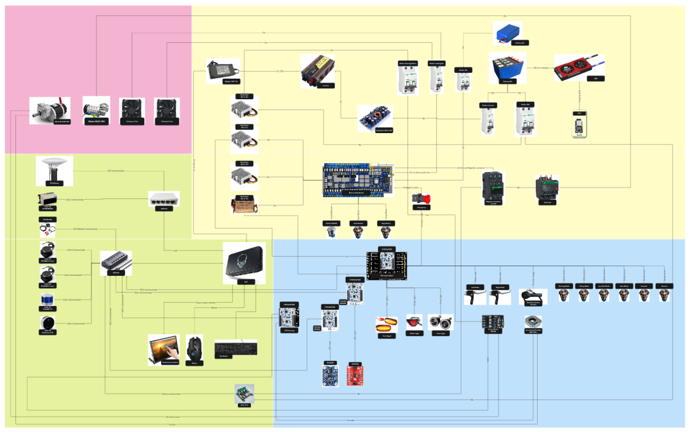
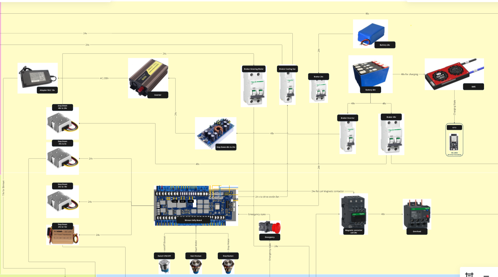
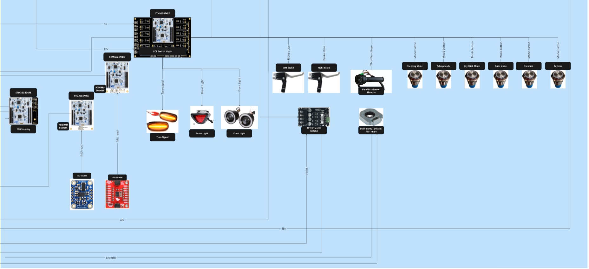
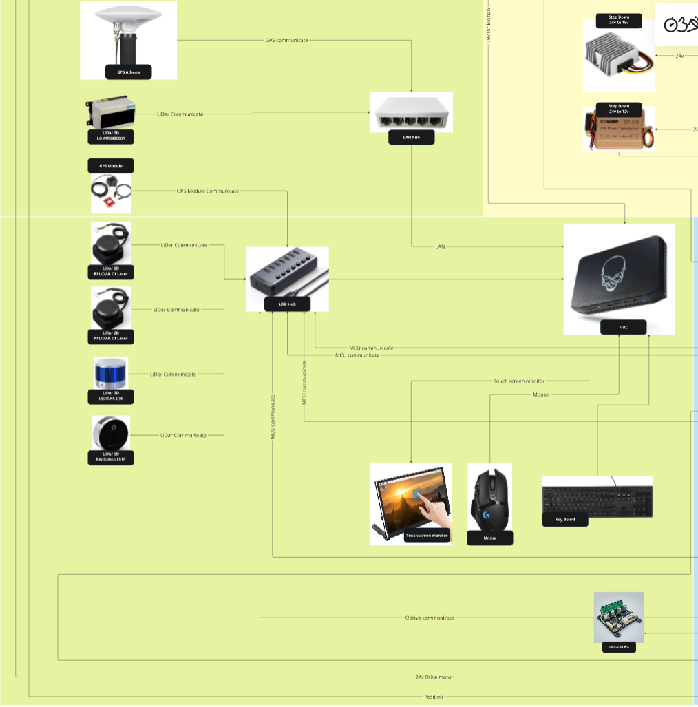
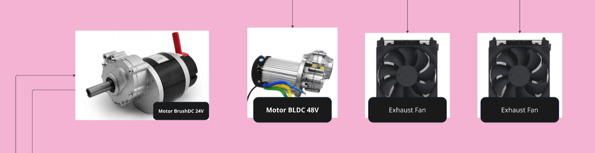

# Carver Electrical

## Introduction

The **Carver Electrical** system is the backbone of the Carver vehicle, integrating power management, safety features, control units, sensors, and actuators to ensure seamless operation across all modes. This document provides a detailed overview of the electrical system architecture, organized into key components for better understanding.

---

## Table of Contents

1. [System Architecture Overview](#system-architecture-overview)
2. [Power & Safety](#power--safety)
   - [Dual Battery System](#dual-battery-system)
   - [Birman Safety Board](#birman-safety-board)
   - [Step-Down Conversions](#step-down-conversions)
   - [Battery Management and Charging](#battery-management-and-charging)
   - [Brushless Motor Safety](#brushless-motor-safety)
   - [Inverter System](#inverter-system)
   - [Circuit Breakers](#circuit-breakers)
3. [MCU & Interface](#mcu--interface)
   - [1st MCU: PCB Switch Mode](#1st-mcu-pcb-switch-mode)
   - [2nd MCU: PCB Steering](#2nd-mcu-pcb-steering)
   - [3rd MCU: PCB IMU BNO055](#3rd-mcu-pcb-imu-bno055)
   - [4th MCU: PCB IMU BNO086](#4th-mcu-pcb-imu-bno086)
   - [Communication to NUC](#communication-to-nuc)
4. [MPU & High-Level Control](#mpu--high-level-control)
   - [NUC Power Supply and Connectivity](#nuc-power-supply-and-connectivity)
   - [Connected Components](#connected-components)
   - [High-Level Communication](#high-level-communication)
   - [USB and LAN Hub Requirements](#usb-and-lan-hub-requirements)
   - [Summary](#summary)
5. [Actuators](#actuators)
   - [Brushless Motor](#brushless-motor)
   - [Steering Motor](#steering-motor)
   - [Cooling Fans](#cooling-fans)
   - [Summary](#summary-1)

---

## System Architecture Overview

This section provides a high-level overview of the Carver electrical system architecture, detailing how power, control, and actuation systems work together to enable the vehicle’s functionality.

You can read full system architecture via this link -> [Full system architecture](https://miro.com/app/board/uXjVLc_L4sE=/?moveToWidget=3458764613666493664&cot=10)

---

## Power & Safety

The Carver system features a robust power and safety architecture designed to ensure reliable operation, minimize noise interference, and provide maximum safety. Below is a detailed explanation of its components and functionality:

#### Dual Battery System
1. **24V Battery (Low Power System)**:
   - Powers the MCU, processors, sensor modules, and other low-power components.
   - Isolates ground from the actuator system to reduce electromagnetic noise generated by actuators, particularly from their coils. This isolation prevents errors in processors and ensures stable operation.

2. **48V Battery (Actuator System)**:
   - Dedicated to powering actuators such as Brushless Motors and the Steering Motor.
   - Connected to the rest of the system only through controlled circuits to maintain isolation and reduce noise.

#### Birman Safety Board
- **Core Safety System**:
  - The Birman Safety Board is the central safety controller in Carver.
  - Features a specific startup sequence:
    1. The **Power Button** on the Birman board must be pressed to activate the board.
    2. The **Start Button** must then be pressed to enable the system.
  - When the **Stop Button** is pressed, the board immediately cuts power to the motors.
  - Continuously monitors the **Emergency State**. If an emergency is detected (e.g., Emergency Button is pressed), the system:
    - Prevents the **Start Button** from functioning until the emergency is resolved.
    - Ensures motors do not start automatically when the emergency condition is cleared, adding an extra layer of safety.

- **Power Control**:
  - When in the **StartMotor** state, the Birman board sends a 24V signal to the magnetic contactor’s coil, activating the bridge to supply 48V from the battery to the ODrive controller. This powers the Brushless Motors.
  - The system design enables motors to be powered from separate supply sources, offering flexibility.

#### Step-Down Conversions
- **Voltage Regulation**:
  - The 48V supply is stepped down to 24V for the Steering Motor and Cooling Fan.
  - The 24V from the Birman board is further stepped down to 19V, 12V, and 5V to power other devices in the system, ensuring efficient power distribution.

#### Battery Management and Charging
- **48V Battery**:
  - Composed of 14 NMC cells in parallel (3.7V per cell).
  - Managed by a Battery Management System (BMS) that ensures:
    - Equal charging and discharging across all cells to maximize lifespan and efficiency.
    - Monitoring of charging current and voltage.
  - ESP32 integrated with the BMS enables real-time monitoring of the charging status via Wi-Fi.

#### Brushless Motor Safety
- **Overload Protection**:
  - The magnetic contactor includes overload protection to disconnect power when the motor draws excessive current, preventing damage.

#### Inverter System
- **AC Power Supply**:
  - Converts 48V from the battery to 24V using a step-down converter.
  - Supplies 24V DC to an inverter, which produces AC power for specific applications.
  - An adapter then converts the AC power to 19V DC to supply the NUC.

#### Circuit Breakers
- **System Safety**:
  - Carver features dedicated breakers to disconnect power in case of overcurrent and as manual switches for system components, including:
    - 24V Battery
    - 48V Battery (for Brushless Motor and Inverter)
    - Steering Motor
    - Cooling Fan
  - Each breaker is selected based on maximum safe current ratings and ensures immediate power cutoff when exceeded.

This comprehensive power and safety design ensures reliable and efficient operation while maintaining user and system safety.

---

## MCU & Interface

The Carver system integrates four microcontroller units (MCUs), all based on the STM32G474RE, which leverage **micro-ROS** for efficient communication between low-level and high-level systems. Each MCU has specific responsibilities and communicates with a central high-level processor (NUC) for seamless operation.

#### 1st MCU: PCB Switch Mode
- **Purpose**: This board serves as the primary interface for user inputs and system state monitoring.
- **Features**:
  - Reads critical inputs:
    - **Brake State**: Monitors the brake engagement status.
    - **Throttle Voltage**: Measures throttle input to determine desired speed.
    - **Mode Buttons**: Reads the state of six mode buttons:
      - Steering Mode
      - Teleop Mode
      - Joystick Mode
      - Auto Mode
      - Forward
      - Reverse
    - **Emergency State**: Continuously checks for emergency conditions.
  - Controls outputs:
    - **Turn Signals**
    - **Brake Lights**
    - **Front Lights**
  - **Power Requirements**:
    - Operates using 12V and 24V power inputs for controlling various status lights and indicators.

#### 2nd MCU: PCB Steering
- **Purpose**: Manages the operation of the steering motor.
- **Features**:
  - Sends **PWM signals** to the motor driver for precise control of the steering motor.
  - Reads motor velocity via an **encoder**, enabling accurate feedback control.
  - Monitors the **Emergency State** for immediate system safety responses.

#### 3rd MCU: PCB IMU BNO055
- **Purpose**: Reads and processes data from the **BNO055 IMU sensor**.
- **Features**:
  - Provides orientation and motion data critical for navigation and stability.
  - Sends processed sensor data to the NUC for high-level decision-making.

#### 4th MCU: PCB IMU BNO086
- **Purpose**: Reads and processes data from the **BNO086 IMU sensor**.
- **Features**:
  - Supplies advanced motion and orientation data with higher precision.
  - Communicates with the NUC to enhance navigation and stability through redundant IMU readings.

#### Communication to NUC
- All four MCUs communicate with the **NUC**, which serves as the high-level processing unit.
- The MCUs send critical data and receive commands via **micro-ROS**, enabling robust and real-time communication between low-level and high-level systems.

This modular and distributed MCU architecture ensures reliable performance, scalability, and seamless integration of all control, monitoring, and actuation systems in Carver.

---

## MPU & High-Level Control

The **Core Processing Unit** of the Carver system is a **NUC (Next Unit of Computing)**, which serves as the high-level controller for coordinating all system operations. Below is a detailed explanation of its architecture and responsibilities:

#### NUC Power Supply and Connectivity
- **Power Supply**:
  - Powered by a **19V adapter** to ensure stable operation.
- **Connectivity**:
  - Communicates with various devices via **USB** and **LAN**.
  - Due to the limited number of native USB ports on the NUC, the system employs:
    - **USB Hub**: Provides additional USB ports for connecting multiple sensors.
    - **LAN Hub**: Expands LAN connectivity for additional devices.
  - Both hubs require an **external 12V power supply** to ensure all connected devices receive sufficient power.

#### Connected Components
The NUC interfaces with the following sensors and peripherals via USB and LAN:
1. **LiDAR Sensors**:
   - **LiDAR 3D RealSense L515**: For precise 3D mapping and navigation.
   - **LiDAR 3D LSLIDAR C16**: Powered by 24V, used for long-range 3D scanning.
   - **LiDAR 2D RPLIDAR C1 Laser**: Provides 2D scanning for obstacle detection.
   - **LiDAR 3D LD-MRS400001**: Powered by 24V, used for advanced 3D environmental perception.
2. **GPS Modules**:
   - **GPS Module**: Standard module for location tracking.
   - **GPS Athena**: High-precision GPS for enhanced navigation accuracy.
3. **Peripherals**:
   - **Touchscreen Monitor**: Provides user interface and display functionality.
   - **Mouse and Keyboard**: For manual operation and system configuration.

#### High-Level Communication
- **ODrive Motor Controller**:
  - The NUC communicates with the ODrive controller to manage the **Brushless Motors** at a high level.
  - Enables precise control and monitoring of motor performance for smooth operation.

#### USB and LAN Hub Requirements
- The **USB Hub** and **LAN Hub** are critical for connecting all sensors and peripherals to the NUC.
- Both hubs are powered by an **external 12V supply** to ensure adequate power for multiple high-power devices, such as LiDAR sensors and GPS modules.

#### Summary
The NUC acts as the central processing unit, integrating data from various sensors, managing motor control via ODrive, and interfacing with user peripherals. This high-level architecture ensures seamless communication and coordination between all components in the Carver system.

---

## Actuators

The Carver system is equipped with three key actuators to manage movement, steering, and cooling. Below is an explanation of their functions and configurations:

#### 1. Brushless Motor
- **Power Supply**: Operates at **48V** and is driven by the **ODrive motor controller**.
- **Purpose**:
  - Provides the main propulsion for Carver, enabling it to move forward and backward.
  - Precisely controls velocity for smooth and efficient operation.

#### 2. Steering Motor
- **Power Supply**: Operates at **24V** and is driven by the **Cytron MD20A motor driver**.
- **Purpose**:
  - Controls the steering mechanism to turn the vehicle left or right.
  - Ensures precise and responsive steering for navigating various environments.

#### 3. Cooling Fans
- **Configuration**: Two fans are installed to provide active cooling.
- **Power Supply**: Operates at **24V**.
- **Purpose**:
  - Maintains optimal airflow to cool all components in the electrical control box.
  - Prevents overheating and ensures reliable performance of the system.

### Summary
These actuators form the core mechanical components of Carver, enabling smooth propulsion, precise steering, and efficient cooling to maintain overall system performance and reliability.

